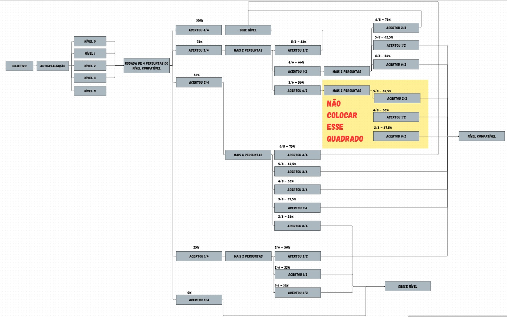

# Version 3 — Internal Evolution (3.1 → 3.3)

This document focuses exclusively on the internal evolution  
of the level progression logic within Version 3.

It documents the transition from an initial working solution  
to a more structured and maintainable implementation.

---

## Flow Reference

The logic implemented across all sub-versions follows this flow,  
which defines how user accuracy determines level progression  
and additional question rounds.

---

## v3.1 — Initial Logic

[View code](dev_notes/v3_1_initial_logic.py)

The first implementation focuses on making the progression system work.

### Characteristics

- Logic written directly inside the main loop  
- Heavy use of nested conditionals  
- Question limits defined inline  
- No separation between decision logic and actions  

### Problem

- High repetition  
- Difficult to scale  
- Hard to visualize or modify the flow  

---

## v3.2 — Partial Refactor

[View code](dev_notes/v3_2_refactor.py)

This version introduces functions to reduce duplication  
in level transition actions.

### What Changed

- Extracted level transition actions into functions  
- Reduced repetition in execution steps  

### Remaining Problems

- Decision logic still duplicated across rounds  
- Core structure still based on nested conditionals  
- Functions mix logic and output  
- No abstraction of progression rules  

---

## v3.3 — Structured Logic

[View code](code.py)

The final version reorganizes the progression system  
to reduce duplication and improve clarity.

### What Improved

- Centralized progression control  
- Reduced repetition across rounds  
- Clearer structure of decision flow  
- More maintainable logic  

---

## Key Insight

Refactoring actions without restructuring decision logic  
does not solve the core problem.

The real improvement comes from organizing how decisions are made,  
not just how actions are executed.

---

## Summary

v3.1 → Working but repetitive logic  
v3.2 → Partial improvement through function extraction  
v3.3 → Structured and maintainable progression logic
